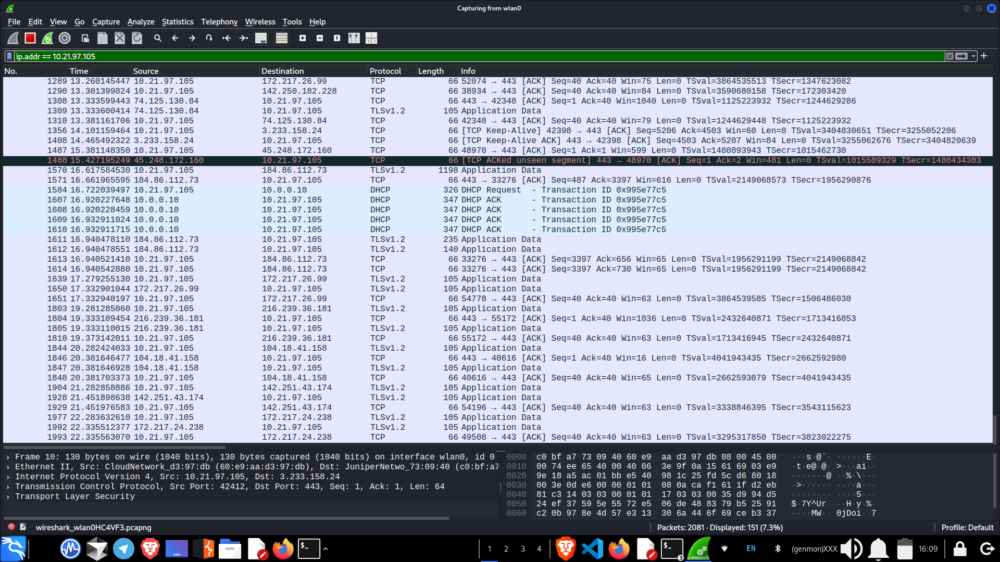

# TASK1
Scan Your Local Network for Open Ports
# 🔍 Network Scanning, TCP SYN Scan & Subnetting Overview



This document provides an overview of **Port Scanning**, **TCP SYN Scan**, **Network Reconnaissance**, and **Subnetting** with examples and real scan outputs.

---

## 🛰️ Port Scanning

Port scanning is the process of checking a device or server to see which network ports are **open**, **closed**, or **filtered**.  
It is widely used for:

- 🔐 Security auditing  
- 🕵️ Reconnaissance  
- 🖥️ Service discovery  

Attackers use it to find weaknesses, while defenders use it to secure their systems.

---

## ⚡ TCP SYN Scan

A **TCP SYN Scan** (`-sS` in Nmap) is a **stealthy and fast** scanning technique.  
It sends only the first step of the TCP handshake:

- **SYN →** sent by scanner  
- **SYN/ACK →** port is **open**  
- **RST →** port is **closed**

Because the handshake is never completed, it is less likely to be detected by firewalls and logging systems.

---

## 🖥️ Example: TCP SYN Scan Output

```
┌──(shivuu㉿shivuu)-[~]
└─$ nmap -sS 10.164.189.0/24

Starting Nmap 7.95 ( https://nmap.org ) at 2025-11-14 12:13 IST

Nmap scan report for 10.164.189.245
Host is up (0.056s latency).
Not shown: 999 closed tcp ports (reset)
PORT   STATE SERVICE
53/tcp open  domain
MAC Address: A2:76:04:CA:12:07 (Unknown)

Nmap scan report for 10.164.189.56
Host is up (0.0000050s latency).
Not shown: 999 closed tcp ports (reset)
PORT   STATE SERVICE
80/tcp open  http

Nmap done: 256 IP addresses (2 hosts up) scanned in 16.38 seconds
```

---

## 🌐 IP Ranges

An IP range is a block of IP addresses (e.g., `192.168.1.0/24`).  
It is commonly used for:

- 🔍 Scanning entire subnets  
- 📡 Discovering active hosts  
- 🛡️ Network auditing  

Example: `10.164.189.0/24` contains **256 IPs (0–255).**

---

## 🕵️ Network Reconnaissance

Network reconnaissance is the process of gathering information about a network, including:

- Active hosts  
- Open ports  
- Running services  
- OS versions  
- Network topology  

It is the **first phase** of both ethical hacking and cyberattacks.

---

## 🔓 Open Ports

An open port is actively accepting connections because a service is listening.

Common ports:

- **22** → SSH  
- **80** → HTTP  
- **443** → HTTPS  

Open ports are necessary for communication but increase the attack surface if not secured.

---

## 🔐 Network Security Basics

Key principles:

- **Least exposure:** Only open required ports  
- **Firewalls:** Block unwanted traffic  
- **Patching:** Fix vulnerabilities timely  
- **Strong authentication:** Secure access points  
- **Monitoring:** Detect anomalies  
- **Encryption:** Protect data in transit (HTTPS, SSH)

---


# 🧮 What is Subnetting?

Subnetting divides a large network into smaller, manageable sub-networks (subnets).  
Benefits include:

- Better performance  
- Enhanced security  
- Efficient IP usage  
- Reduced broadcast traffic  

---

## 💡 Basic Idea

Every IPv4 address has:

- **Network part**
- **Host part**

Subnetting increases the **network bits** and reduces **host bits**.

---

# 📘 Example: Subnetting `192.168.1.0/24` into 4 Subnets

### Original Network:

- Network: `192.168.1.0`
- Mask: `/24` → `255.255.255.0`
- Hosts: 256 addresses (254 usable)

### Step 1: New Mask

To create 4 subnets:  
2² = 4 → need **2 new bits**

- New mask: **/26**
- Subnet mask: `255.255.255.192`

### Step 2: Block Size

```
Block size = 256 − 192 = 64
```

Each subnet increases by 64.

---

## 📡 The 4 Subnets

### **Subnet 1**
- Network: `192.168.1.0`
- Range: `192.168.1.1 → 192.168.1.62`
- Broadcast: `192.168.1.63`

### **Subnet 2**
- Network: `192.168.1.64`
- Range: `192.168.1.65 → 192.168.1.126`
- Broadcast: `192.168.1.127`

### **Subnet 3**
- Network: `192.168.1.128`
- Range: `192.168.1.129 → 192.168.1.190`
- Broadcast: `192.168.1.191`

### **Subnet 4**
- Network: `192.168.1.192`
- Range: `192.168.1.193 → 192.168.1.254`
- Broadcast: `192.168.1.255`

---

# 📌 Summary of What We Achieved

- Started with: `192.168.1.0/24`  
- Created **4 subnets**, each with:
  - 64 total addresses  
  - 62 usable hosts  

Subnetting helps:

- Reduce congestion  
- Improve network organization  
- Enhance security  
- Manage IPs efficiently  
